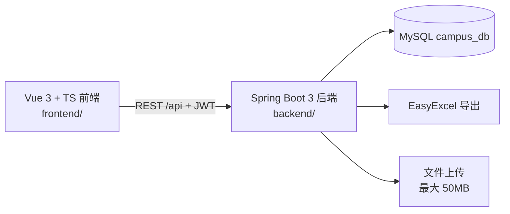

<div align="center">

# 🏫 CampusHub

### Campus Activity & Competition Management Platform · 高校活动竞赛管理平台

**全栈双角色平台 —— 让校园活动与竞赛的发布、审核、报名、参赛全流程井然有序**

> **EN** · CampusHub is a full-stack campus activity and competition management platform built with Vue 3, TypeScript, Vite and Spring Boot. It ships a dual-role experience — admins publish, audit and manage activities & competitions with one-click Excel export; students browse, register and track participation from a personal cockpit. JWT-secured, MySQL-backed, ready out of the box.

[](https://vuejs.org/)
[](https://www.typescriptlang.org/)
[](https://vitejs.dev/)
[](https://pinia.vuejs.org/)
[](https://spring.io/projects/spring-boot)
[](https://mybatis.org/)
[](https://www.mysql.com/)
[](https://jwt.io/)
[](https://github.com/alibaba/easyexcel)
[](LICENSE)

[快速开始](#-快速开始) · [环境变量](#-环境变量) · [项目结构](#-项目结构) · [部署](#-部署)

</div>

---

## ✨ 核心特性

### 👨‍💼 管理员端
- ✅ 活动发布 / 管理 / 详情 / **审核**，全流程可控
- ✅ 竞赛发布 / 管理 / 详情 / **审核**，一站式主办
- ✅ 干部设置（Cadre Setting）与**用户管理**
- ✅ 数据仪表盘，运营情况一目了然
- ✅ **EasyExcel 一键导出**，名单报表随手可得

### 🎓 学生端
- ✅ 活动 / 竞赛**浏览与报名**
- ✅ 竞赛驾驶舱（Competition Cockpit）—— 个人参赛进度总览
- ✅ 我的报名 / 我的参赛 / 我的参与，个人记录完整留存
- ✅ 通知公告 + 站内消息，重要信息不遗漏
- ✅ 个人中心，资料自主维护

| 功能 | 管理员 | 学生 |
|---|:---:|:---:|
| 活动发布/审核 | ✅ | — |
| 竞赛发布/审核 | ✅ | — |
| 用户/干部管理 | ✅ | — |
| 数据仪表盘 | ✅ | — |
| Excel 导出 | ✅ | — |
| 浏览与报名 | — | ✅ |
| 竞赛驾驶舱 | — | ✅ |
| 消息通知 | — | ✅ |

## 🏗️ 技术架构



- **前端**：Vue 3 `<script setup>` + TypeScript + Vite + Pinia（持久化）+ Vue Router + Axios（拦截器自动携带 Token）
- **后端**：Spring Boot 3 + MyBatis + MySQL + JWT 认证 + EasyExcel 报表 + 文件上传

## 🚀 快速开始

### 前置要求
| 组件 | 版本 |
|---|---|
| JDK | 17+ |
| Maven | 3.6+ |
| Node.js | 18+ |
| MySQL | 8.x |

### 1️⃣ 启动后端（`backend/`）

```bash
# 1. 准备数据库
mysql -u root -p -e "CREATE DATABASE IF NOT EXISTS campus_db DEFAULT CHARACTER SET utf8mb4;"

# 2. 配置环境变量（可选，均有默认值）
export DB_HOST=localhost
export DB_PASSWORD=你的数据库密码

# 3. 启动
mvn spring-boot:run
```

后端默认运行在 `http://localhost:8080`

### 2️⃣ 启动前端（`frontend/`）

```bash
cd frontend
npm install
npm run dev
```

前端默认运行在 `http://localhost:5173`，开发环境已将 `/api` 代理到后端 8080 端口，开箱即用。

## 🔑 环境变量

| 变量 | 默认值 | 说明 |
|---|---|---|
| `DB_HOST` | `localhost` | MySQL 地址 |
| `DB_PORT` | `3306` | MySQL 端口 |
| `DB_NAME` | `campus_db` | 数据库名 |
| `DB_PASSWORD` | `1234` | 数据库密码 |
| `CAMPUS_UPLOAD_PATH` | `D:/campus-uploads/` | 文件上传目录 |

## 📁 项目结构

```
CampusHub/
├── frontend/                  # Vue 3 + TS 前端
│   └── src/
│       ├── api/               # 接口模块（activity/competition/auth/audit...）
│       ├── views/
│       │   ├── admin/         # 管理员端（发布/审核/管理/用户/仪表盘）
│       │   └── student/       # 学生端（报名/驾驶舱/我的参与/消息）
│       ├── layouts/           # AdminLayout / UserLayout
│       ├── stores/            # Pinia（用户态持久化）
│       └── utils/             # axios 封装 / 字典
└── backend/                   # Spring Boot 3 后端
    └── src/main/java/.../
        ├── controller/        # User / Activity / Competition / Audit
        ├── service/           # 业务逻辑
        └── ...                # MyBatis 映射 / JWT / EasyExcel
```

## 📦 部署

### 生产构建

```bash
# 后端
cd backend && mvn package -DskipTests   # 产出 target/campus-server.jar

# 前端
cd frontend && npm run build             # 产出 dist/
```

### Nginx 参考配置

```nginx
server {
    listen 80;
    server_name campus.example.com;
    root /opt/campus/dist;               # 前端构建产物
    index index.html;

    location /api/ {
        proxy_pass http://127.0.0.1:8080; # 后端
        proxy_set_header Host $host;
        proxy_set_header X-Real-IP $remote_addr;
    }

    location / {
        try_files $uri $uri/ /index.html; # SPA 路由
    }
}
```

> 默认上传路径为 `D:/campus-uploads/`，可通过 `CAMPUS_UPLOAD_PATH` 环境变量调整。

## 📜 License

[MIT](LICENSE) © 2026 RongYu

**CampusHub · 高校活动竞赛管理平台**
