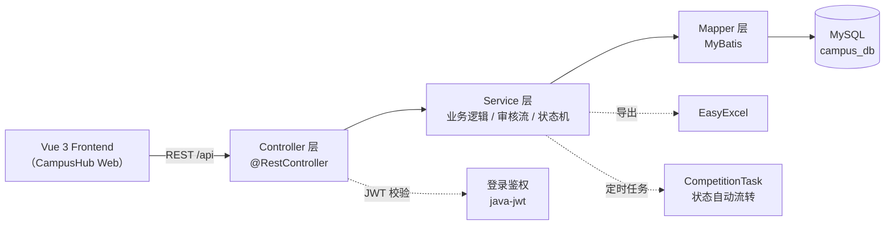

<div align="center">

# 🚀 CampusHub Server · 高校活动竞赛管理平台后端

**CampusHub REST API — Spring Boot · MyBatis · MySQL · JWT**

> CampusHub 平台的服务端，为前端提供活动、竞赛、审核、用户管理的一站式 API。
>
> The server backbone of CampusHub: activity & competition management, credit certification and user administration.

[](https://spring.io/projects/spring-boot)
[](https://mybatis.org/)
[](https://www.mysql.com/)
[](https://github.com/auth0/java-jwt)
[](https://easyexcel.opensource.alibaba.com/)
[](https://adoptium.net/)
[](LICENSE)

</div>

---

## 📖 项目简介

**CampusHub Server** 是 [CampusHub 高校活动竞赛管理平台](https://github.com/) 的后端服务，使用 **Spring Boot + MyBatis + MySQL** 构建，为前端提供活动管理、竞赛管理、学分认定审核与用户管理等 RESTful API。

- 🏛️ **活动管理** — 校内 / 校外活动发布、报名、核验、工时结算与参与者导出
- 🏆 **竞赛管理** — 竞赛全生命周期状态机（报名 → 执行 → 评审 → 公示），支持个人 / 组队模式
- ✅ **认定审核** — 竞赛认定与志愿工时在线申报审核，全程留痕、可回滚
- 👥 **用户管理** — 全校用户检索、账号启停、学生干部（班级认定员）设置

> ⚠️ 本仓库为 **后端** 部分，配套前端见 [CampusHub Frontend](https://github.com/)（Vue 3 + TypeScript）。

---

## ✨ 功能特性

- ✅ **双轨业务模型** — 校内（`internal`）与校外（`external`）活动 / 竞赛统一管理
- ✅ **竞赛状态自动流转** — 内置定时任务（`CompetitionTask`），按报名 / 比赛截止时间自动推进赛事状态
- ✅ **认定审核闭环** — 学生在线申报 → 班级干部初审 → 管理员终审，支持驳回与回滚
- ✅ **组队参赛** — 赛事驾驶舱：创建队伍、邀请码加入、作品文件上传、成绩与奖项录入
- ✅ **数据导出** — 基于 EasyExcel 的报名名单 / 参与者一键导出
- ✅ **鉴权与隔离** — JWT 登录态 + 按角色 / 学院 / 班级（学号前 9 位）的数据可见性隔离
- ✅ **统一响应** — `Result<T>` 统一封装，`code / msg / data` 三段式约定

---

## 📸 界面预览

> 📌 **截图待补充** —— 即将更新


---

## 🏗️ 技术架构



| 技术 | 用途 |
| --- | --- |
| [Spring Boot 4.0](https://spring.io/projects/spring-boot) | Web 应用框架（`spring-boot-starter-webmvc`） |
| [MyBatis](https://mybatis.org/) 4.0 | 数据访问层，`map-underscore-to-camel-case` 自动驼峰映射 |
| [MySQL](https://www.mysql.com/) 8.0 | 关系型数据库 |
| [java-jwt](https://github.com/auth0/java-jwt) 4.4 | JWT 登录令牌 |
| [EasyExcel](https://easyexcel.opensource.alibaba.com/) 3.3 | 报名名单 / 参与数据 Excel 导出 |
| [Lombok](https://projectlombok.org/) | 简化实体类样板代码 |

---

## 🚀 快速开始

### 环境要求（Prerequisites）

| 依赖 | 版本要求 |
| --- | --- |
| JDK | 21（Spring Boot 4 要求 17+，项目按 21 构建） |
| MySQL | 8.0+ |
| Maven | 3.9+（或直接使用仓库自带的 `mvnw`） |

### 1. 初始化数据库

```sql
CREATE DATABASE IF NOT EXISTS campus_db
  DEFAULT CHARACTER SET utf8mb4
  COLLATE utf8mb4_unicode_ci;
```

> 📌 本项目使用 **MyBatis**，**不会自动建表**：需根据 [数据库设计](#-数据库设计) 中的表结构手动建表（或迁移至 JPA 后使用 `ddl-auto` 自动建表）。仓库未包含建表 SQL，后续版本将补充 `schema.sql`。

### 2. 配置环境变量

所有连接信息均支持环境变量覆盖（默认值可直接本地运行）：

| 环境变量 | 默认值 | 说明 |
| --- | --- | --- |
| `DB_HOST` | `localhost` | MySQL 主机地址 |
| `DB_PORT` | `3306` | MySQL 端口 |
| `DB_NAME` | `campus_db` | 数据库名 |
| `DB_PASSWORD` | `1234` | 数据库密码 |
| `CAMPUS_UPLOAD_PATH` | `D:/campus-uploads/` | 文件上传目录 |

### 3. 启动服务

```bash
# 方式一：使用 Maven Wrapper（推荐）
./mvnw spring-boot:run

# 方式二：本地 Maven
mvn spring-boot:run

# 方式三：打包后运行
./mvnw clean package
java -jar target/campus-server-0.0.1-SNAPSHOT.jar
```

启动成功后服务默认运行在 **`http://localhost:8080`**。

---

## 📁 项目结构

```
campus-server-backend/
├── src/main/java/com/lnu/
│   ├── CampusServerApplication.java   # 启动入口
│   ├── common/Result.java             # 统一响应封装
│   ├── config/CorsConfig.java         # 跨域配置
│   ├── controller/                    # REST 控制器
│   │   ├── UserController.java
│   │   ├── ActivityController.java
│   │   ├── CompetitionController.java
│   │   └── AuditController.java
│   ├── service/                       # 业务逻辑层（接口 + 实现）
│   ├── mapper/                        # MyBatis Mapper 接口
│   ├── entity/                        # 数据实体
│   └── task/CompetitionTask.java      # 竞赛状态自动流转定时任务
├── src/main/resources/
│   └── application.yml                # 应用配置（环境变量可覆盖）
├── pom.xml
└── mvnw / mvnw.cmd                    # Maven Wrapper
```

---

## 📡 API 模块

| 模块 | 基础路径 | 主要接口 |
| --- | --- | --- |
| 用户认证 | `/user` | `login` 登录、`info/{id}` 详情、`update/password` 改密、`bind/email` 绑邮箱 |
| 用户管理 | `/user` | `list` 分权查询、`status` 启停、`reset-password` 重置、`set-cadre` 干部设置 |
| 活动管理 | `/activity` | `list` / `detail/{id}`、`create` / `update` / `delete`、`signup` / `cancel`、`verify` 核验、`settle` 结算、`export/participants/{id}` 导出 |
| 竞赛管理 | `/competition` | `list` / `student/list`、`create` / `update` / `status` / `rollback`、`signup` / `join` 组队、`grade` 成绩、`upload` 作品上传 |
| 认定审核 | `/audit` | `apply` 申报、`list` / `list/personal` 查询、`approve` / `reject` / `reset` 审核操作 |

> 统一响应格式：`{ "code": 200, "msg": "success", "data": ... }`，`code = 200` 表示成功，`401` 表示登录失效。

---

## 🗄️ 数据库设计

依据实体类（`entity/`）与 MyBatis 驼峰映射，核心表设计如下：

| 表名 | 说明 | 核心字段 |
| --- | --- | --- |
| `user` | 用户表（学号 / 工号） | `username`（学号）、`password`、`role`（STUDENT / TEACHER / AUDITOR / ROOT）、`college`、`major`、`grade`、`class_name`、`is_cadre`、`score_competition`、`score_volunteer`、`status` |
| `activity` | 活动表 | `title`、`source_type`（internal / external）、`format`、`location`、`need_photo`、`reg_start_time`、`reg_end_time`、`activity_start_time`、`activity_end_time`、`hours`（工时）、`quota`（名额）、`joined`、`status`、`limit_campus / limit_college / limit_grade`（可见性） |
| `competition` | 竞赛表 | `title`、`level`（nation / province / school）、`source_type`、`status`（open → registering → execution → judging → publicity → finished）、`mode`（individual / team）、`format`、`reg_start_time`、`reg_end_time`、`comp_start_time`、`comp_end_time`、`is_qualified`、`joined_count`、`publish_dept` |
| `competition_team` | 竞赛队伍表 | `event_id`、`team_name`、`leader_id`、`team_code`（邀请码）、`file_url / file_name`（作品）、`award_level`、`score`、`submit_time` |
| `competition_member` | 队伍成员表 | `team_id`、`user_id`（成员学号）、`user_name`、`college` |
| `audit_record` | 认定审核记录表 | `user_id`、`type`（volunteer / competition）、`source_type`、`origin_id`、`title`、`score`、`award_level`、`proof_url`（证明材料）、`status`（pending / approved / rejected）、`reject_reason`、`auditor_name`、`audit_time`、`apply_time` |
| `college` | 学院字典表 | 学院基础信息（`CollegeMapper`） |

> 🔧 **建表方式说明**：仓库暂未包含建表 SQL。由于使用 MyBatis，框架**不会自动建表**，需按上表手动创建；若后续改用 JPA（`spring-boot-starter-data-jpa`），可在 `application.yml` 中开启 `spring.jpa.hibernate.ddl-auto: update` 实现自动建表。

---

## 🛠️ 构建与部署（Linux）

```bash
# 1. 打包（跳过测试）
./mvnw clean package -DskipTests

# 2. 上传并启动
scp target/campus-server-0.0.1-SNAPSHOT.jar root@your-server:/opt/campus/
java -jar /opt/campus/campus-server-0.0.1-SNAPSHOT.jar \
  --spring.datasource.url="jdbc:mysql://${DB_HOST}:${DB_PORT}/${DB_NAME}?useUnicode=true&characterEncoding=utf-8&useSSL=false&serverTimezone=Asia/Shanghai" \
  --spring.datasource.password="${DB_PASSWORD}"

# 3. （推荐）使用 systemd 托管，并设置环境变量
# Environment="DB_PASSWORD=xxx" Environment="CAMPUS_UPLOAD_PATH=/data/campus-uploads/"
```

> 默认上传路径为 `D:/campus-uploads/`，可通过 `CAMPUS_UPLOAD_PATH` 环境变量调整。

---

## 📄 License

本项目基于 [MIT](LICENSE) 协议开源。

---

<div align="center">

**© 2026**

</div>
