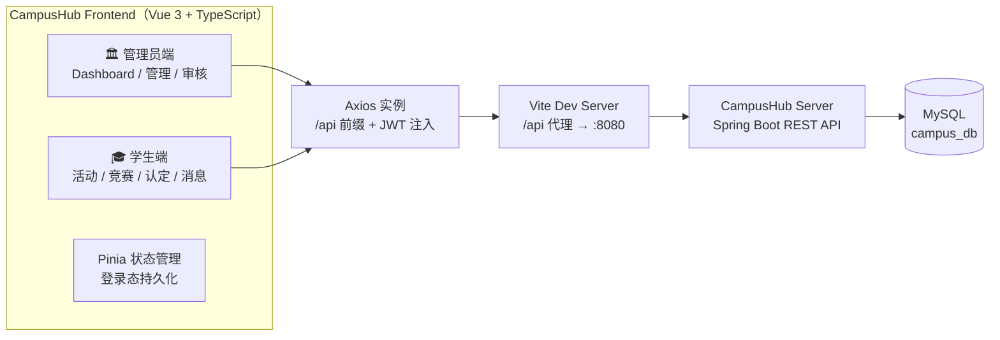

<div align="center">

# 🎓 CampusHub · 高校活动竞赛管理平台

**Campus Activity & Competition Management Platform**

> 集「活动管理 · 竞赛管理 · 学分认定」于一体的高校双端管理系统
>
> A dual-role campus platform that keeps every activity traceable and every competition fairly certified.

[](https://vuejs.org/)
[](https://vite.dev/)
[](https://www.typescriptlang.org/)
[](https://pinia.vuejs.org/)
[](https://element-plus.org/)
[](https://axios-http.com/)
[](LICENSE)

</div>

---

## 📖 项目简介

**CampusHub** 是面向高校的「活动 + 竞赛」一体化管理平台，采用前后端分离架构，覆盖 **管理员端** 与 **学生端** 两大角色。

平台围绕高校日常的 **活动组织** 与 **竞赛认定** 两大核心业务，打通了从发布、报名、执行、审核到学分认定的完整闭环：

- 🏛️ **管理员端**：活动 / 竞赛全流程管理、认定审核中心、全校用户与干部管理
- 🎓 **学生端**：活动报名、竞赛组队参赛、学分认定申报、通知消息与个人中心

> ⚠️ 本仓库为 **前端** 部分，配套后端见 [CampusHub Server](https://github.com/)（Spring Boot + MyBatis + MySQL）。

---

## ✨ 功能特性

### 🏛️ 管理员端

- ✅ **数据驾驶舱** — 活动、竞赛、用户核心指标一屏概览
- ✅ **活动发布与管理** — 校内 / 校外双轨发布、报名名单管理、照片核验、工时结算、参与者一键导出 Excel
- ✅ **竞赛发布与管理** — 校内 / 校外竞赛全生命周期管理（报名 → 执行 → 评审 → 公示）
- ✅ **认定审核中心** — 竞赛认定、志愿工时在线审核，支持通过 / 驳回 / 回滚，全程留痕
- ✅ **用户与干部管理** — 全校用户检索、账号启停、重置密码、**学生干部（班级认定员）** 权限设置

### 🎓 学生端

- ⚡ **活动广场** — 活动浏览、在线报名 / 取消报名、志愿工时累计
- ⚡ **竞赛中心** — 竞赛列表、**赛事驾驶舱 Competition Cockpit**（组队、邀请码加入、作品提交）
- ⚡ **我的参与** — 我的报名 / 我的参赛 / 我的参与记录，一站式追踪
- ⚡ **认定申报** — 竞赛 / 志愿学分在线申报，上传证明材料，实时跟踪审核进度
- ⚡ **消息通知** — 系统通知 + 站内消息，审核结果即时触达
- ⚡ **个人中心** — 个人信息维护、密码修改、邮箱绑定

---

## 📸 界面预览

> 📌 **截图待补充** —— 即将更新


---

## 🏗️ 技术架构



| 技术 | 用途 |
| --- | --- |
| [Vue 3](https://vuejs.org/) + [TypeScript](https://www.typescriptlang.org/) | 组合式 API 组件开发，类型安全 |
| [Vite](https://vite.dev/) | 极速开发服务器与构建工具 |
| [Pinia](https://pinia.vuejs.org/) + `pinia-plugin-persistedstate` | 全局状态管理，登录态本地持久化 |
| [Vue Router](https://router.vuejs.org/) | 路由与**基于角色的权限守卫**（管理员 / 学生 / 学生干部 / 教师） |
| [Element Plus](https://element-plus.org/) | 企业级 UI 组件库 |
| [Axios](https://axios-http.com/) | 统一请求封装：拦截器、Token 注入、401 自动跳转、Blob 流放行 |

---

## 🚀 快速开始

### 环境要求（Prerequisites）

| 依赖 | 版本要求 |
| --- | --- |
| Node.js | `^20.19.0` 或 `>=22.12.0`（见 `package.json` engines） |
| 包管理器 | npm 10+ |
| 后端服务 | 已启动的 CampusHub Server（默认 `http://localhost:8080`） |

### 安装与启动

```bash
# 1. 安装依赖
npm install

# 2. 启动开发服务器（默认 http://localhost:5173）
npm run dev

# 3. 生产构建
npm run build

# 4. 本地预览构建产物
npm run preview

# 5. 代码检查
npm run lint
```

### 环境变量说明

本项目**开箱即用、无需配置 `.env`**：开发模式下，Vite 会将 `/api` 开头的请求代理到 `http://localhost:8080`（见 `vite.config.ts`）。

| 场景 | 配置方式 |
| --- | --- |
| 修改后端地址 | 编辑 `vite.config.ts` 中 `server.proxy['/api'].target` |
| 生产环境 | 由 Nginx 等反向代理将 `/api` 转发至后端，前端代码无需改动 |

---

## 📁 项目结构

```
campus-platform/
├── public/                  # 静态公共资源
├── src/
│   ├── api/                 # Axios 接口封装（activity / competition / audit / auth …）
│   ├── assets/              # 静态资源（LNU Logo、全局样式）
│   ├── layouts/             # 布局组件（AdminLayout / UserLayout）
│   ├── router/              # 路由配置 + 角色权限守卫
│   ├── stores/              # Pinia 状态（user / counter）
│   ├── types/               # TypeScript 类型定义（model.d.ts）
│   ├── utils/               # 工具库（request 封装、枚举字典）
│   └── views/
│       ├── admin/           # 🏛️ 管理员端页面
│       │   ├── login/       # 管理员登录
│       │   ├── Dashboard.vue
│       │   ├── Activity*.vue / Competition*.vue
│       │   ├── ActivityAudit.vue / CompetitionAudit.vue
│       │   ├── CadreSetting.vue / UserManage.vue
│       │   └── …
│       └── student/         # 🎓 学生端页面
│           ├── login/       # 学生登录
│           ├── Home.vue / ActivityList.vue / CompetitionList.vue
│           ├── CompetitionCockpit.vue
│           ├── MyApplication.vue / MyCompetitions.vue / MyParticipations.vue
│           ├── NoticeList.vue / StudentMessage.vue / Profile.vue
│           └── …
├── index.html
├── package.json
├── vite.config.ts           # Vite 配置（@ 别名、/api 跨域代理）
├── tsconfig*.json
└── eslint.config.ts
```

---

## 🎯 功能矩阵

| 功能模块 | 🏛️ 管理员 | 🎓 学生 |
| --- | :-: | :-: |
| 数据驾驶舱 Dashboard | ✅ | — |
| 活动发布 / 管理 / 详情 | ✅ | — |
| 竞赛发布 / 管理 / 详情 | ✅ | — |
| 认定审核（竞赛 / 志愿） | ✅ 审核 | ✅ 申报 |
| 用户管理 / 干部设置 | ✅ | — |
| 活动浏览 / 报名 / 取消 | — | ✅ |
| 竞赛浏览 / 组队 / 参赛 | — | ✅ |
| 赛事驾驶舱 Competition Cockpit | — | ✅ |
| 我的报名 / 参赛 / 参与 | — | ✅ |
| 通知与站内消息 | — | ✅ |
| 个人中心 / 学分查看 | — | ✅ |

---

## 🛠️ 构建与部署

### 本地构建

```bash
npm run build        # 输出到 dist/
npm run type-check   # 类型检查（vue-tsc）
```

### Nginx 部署要点（Linux）

```nginx
server {
    listen 80;
    server_name your-domain.com;
    root /var/www/campus-platform/dist;
    index index.html;

    # 前端路由（history 模式）回退
    location / {
        try_files $uri $uri/ /index.html;
    }

    # API 反向代理 → 后端服务
    location /api {
        proxy_pass http://127.0.0.1:8080;
        proxy_set_header Host $host;
        proxy_set_header X-Real-IP $remote_addr;
    }
}
```

---

## 📄 License

本项目基于 [MIT](LICENSE) 协议开源。

---

<div align="center">

**© 2026 荣峪 (RongYu)** · Made with ❤️ for campus life

</div>
